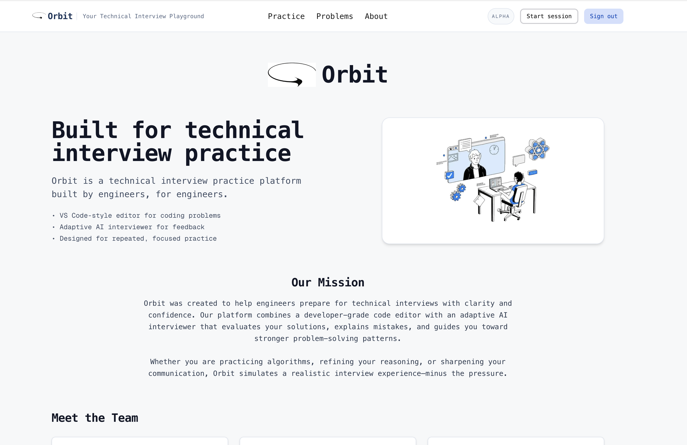
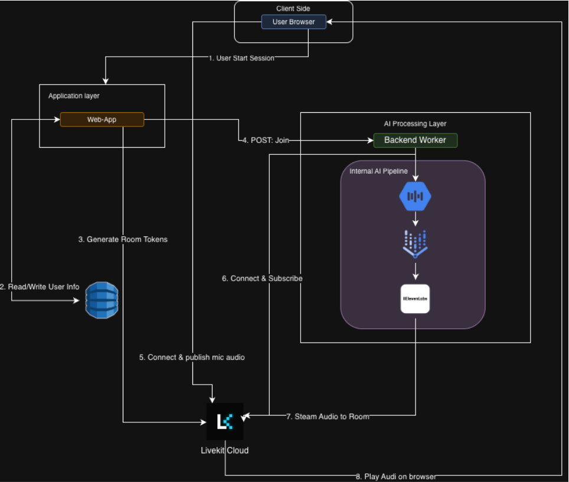

# Orbit — Personalized Interview Preparation Assistant

## Deployment Link

https://orbit-app-mt7to.ondigitalocean.app/

## Overview



**Orbit** is an intelligent, personalized interview preparation system that leverages large language models and retrieval-augmented generation to simulate technical interviews, evaluate responses, and provide targeted feedback.  
The system aims to make interview preparation more engaging and adaptive, with a focus on coding and system design interviews.

---

## Motivation
Job searching has become increasingly competitive, and candidates often struggle with limited, generic resources that do not adapt to their learning pace or strengths. While existing tools like LeetCode and mock interview services provide practice, they lack interactivity and personalized feedback loops.

Our project seeks to build an AI-powered assistant that:
- Conducts personalized mock interviews.
- Evaluates user responses for accuracy, clarity, and reasoning quality.
- Provides actionable, constructive feedback to guide future practice.

By integrating LLMs with retrieval systems and multimodal input (text, speech, and visuals), we can create a more natural, data-informed preparation experience that evolves with the user.

---

## Related Works

### 1. SimInterview (Nguyen et al., 2025)
[Paper](https://arxiv.org/abs/2508.11873)

**Summary:**  
SimInterview is a multilingual interview simulation system powered by LLMs. It integrates speech recognition, text generation, and visual avatars to simulate real interview experiences and adapts prompts to users’ resumes and target roles.

**Strengths:**
- Comprehensive multimodal design (speech + avatars).  
- Tested across multiple roles and languages.

**Limitations:**
- Focuses primarily on business interviews.  
- Lacks technical evaluation and coding-specific feedback.

---

### 2. Towards Smarter Hiring (Maity et al., 2025)
[Paper](https://arxiv.org/abs/2504.05683)

**Summary:**  
Introduces the HURIT dataset containing ~3,890 real HR interview transcripts. Evaluates pretrained LLMs for automated scoring, feedback generation, and error detection in HR interviews.

**Strengths:**
- Real-world data and human baselines.  
- Rigorous zero-shot and few-shot evaluation.

**Limitations:**
- Focused on HR interviews rather than technical problem-solving.  
- Feedback quality lacks precision in algorithmic reasoning contexts.

---

### 3. Zara (Yazdani et al., 2025)
[Paper](https://arxiv.org/abs/2507.02869)

**Summary:**  
A GPT-4-based AI interviewer that conducts candidate interviews and provides feedback using RAG-grounded evaluations aligned with real interview rubrics.

**Strengths:**
- Scalable feedback generation.  
- Hybrid RAG + LLM framework for reduced hallucination.

**Limitations:**
- Does not assess code correctness or technical logic.  
- Relies on human validation for reliability.

---

## Methodology

### System Architecture
Our system consists of the following core components:

1. **Fine-Tuned LLM Interviewer**  
   Custom **Gemini 2.5 Flash** model fine-tuned on synthetic interview dialogues. Uses Socratic questioning to guide candidates without giving direct answers.

2. **Retrieval-Augmented Generation (RAG)**  
   - **DynamoDB**: Stores 1800+ LeetCode problems with solutions and video tutorial transcripts  
   - **Context Injection**: Problem descriptions, hidden solution code, and transcript-derived hints injected into system prompts  
   - Real-time retrieval during interviews to ground responses in factual content

3. **Real-Time Voice System**  
   - **LiveKit**: WebRTC infrastructure for low-latency audio streaming  
   - **Google Cloud STT**: Streaming speech-to-text with automatic punctuation  
   - **Google Cloud TTS**: Neural voice synthesis (en-US-Neural2-J)  
   - Round-trip latency: ~3-4 seconds from speech to AI response

4. **Interactive Coding Workspace**  
   - **Monaco Editor**: VS Code-powered code editor with Python syntax highlighting  
   - **Live Code Sync**: User code streamed to AI interviewer via LiveKit data channel  
   - Context-aware feedback based on current code state

5. **Full-Stack Web Application**  
   - **Frontend**: Next.js with React, Tailwind CSS, LiveKit components  
   - **Backend**: FastAPI service with endpoint for LLM generation  
   - **Worker**: Node.js LiveKit worker orchestrating STT/TTS pipeline  
   - **Deployment**: Docker Compose for multi-service orchestration

## System Diagram:


---

## Tools & Technologies

| Category | Tools / Libraries |
|-----------|------------------|
| **LLM & AI** | Google Gemini 2.5 Flash (fine-tuned), Vertex AI |
| **Backend** | FastAPI, Node.js, Express |
| **Frontend** | Next.js 14, React, Tailwind CSS, Monaco Editor |
| **Database** | DynamoDB (AWS) |
| **Real-Time Audio** | LiveKit, Google Cloud STT/TTS |
| **Data Processing** | Python, Pandas, YouTube Transcripts API |
| **Deployment** | Docker, Docker Compose |
| **Version Control** | Git, GitHub |

---

## Datasets

### 1. Software Engineering Interview Questions Dataset
[Kaggle](https://www.kaggle.com/datasets/syedmharis/software-engineering-interview-questions-dataset)  
Contains 250 general technical questions suitable for evaluating base-level understanding of software engineering concepts.

**Use Case:**  
Serves as a foundation for question generation and testing baseline model performance.

---

### 2. LeetCode Problem Dataset
[Kaggle](https://www.kaggle.com/datasets/gzipchrist/leetcode-problem-dataset)  
Contains 1,825 LeetCode problems with difficulty levels, topics, and acceptance rates.

**Use Case:**  
Provides structured question data for fine-tuning generation models and analyzing patterns in problem selection.

---

### 3. LeetCode Solution Dataset (Python)
[Kaggle](https://www.kaggle.com/datasets/jacobhds/leetcode-solutions-and-content-kpis)  
Contains LeetCode problem solutions from the forum section of leetcode with identifiers like upvotes, views, and the solutions in python3

**Use Case:**  
Provides structured solution data for fine-tuning generation models and analyzing user-inputted solutions

---

### 4. YouTube Coding Interview Walkthroughs

See [Video_Processing.md](./Documents/Video_Processing.md) for more info.

**Pipeline:**

1. **Transcript Extraction**: YouTube auto-generated captions via YouTube Transcripts API  
2. **Problem Mapping**: Match videos to LeetCode problem IDs via title parsing  
3. **Data Aggregation**: Merge transcripts with LeetCode problem metadata and solution code  
4. **Synthetic Dialogue Generation**: Use Gemini 2.5 Flash to convert monologue transcripts into realistic interviewer-candidate conversations

**Dataset Stats:**
- **480+ videos** from channels like NeetCode, TechLead  
- **6.7MB CSV** with problem transcripts  
- **1825 unique problems** mapped (60-70% transcript coverage)  
- **220+ training dialogues** generated for fine-tuning

**Purpose:**  
Provides real-world pedagogical content for RAG. Transcript hints guide the AI interviewer on how to explain concepts effectively, mirroring high-quality YouTube tutorials.

---

## Evaluation Plan

| Metric | Description |
|--------|--------------|
| **Feedback Accuracy** | Human evaluators assess model feedback against expert answers. |
| **Question Relevance** | Cosine similarity between generated and benchmark question sets. |
| **User Improvement** | Track user score trends and performance over time. |
| **Response Coherence** | Measure contextual consistency across multiple feedback turns. |

---

## Work Plan

| Week | Focus | Planned Tasks |
|------|--------|---------------|
| **1 (10/07–10/13)** | Ideation | Finalize proposal, literature review, meet TA |
| **2 (10/14–10/20)** | Data & Setup | Collect and preprocess datasets, begin EDA |
| **3 (10/21–10/27)** | Model Baseline | Build static LLM chain for question generation and scoring |
| **4 (10/28–11/03)** | Adaptive Feedback | Integrate evaluation loops, add personalized question selection |
| **5 (11/04–11/10)** | UI Prototyping | Build Flask-based frontend and connect backend models |
| **6 (11/11–11/17)** | Midpoint Demo | Internal presentation and debugging |
| **7 (11/18–11/24)** | Evaluation | Implement feedback metrics and small user study |
| **8 (11/25–12/01)** | Refinement | Optimize prompts, conduct ablation studies |
| **9 (12/02–12/08)** | Visualization | Generate analysis plots and performance trends |
| **10 (12/09–12/15)** | Finalization | Prepare report, demo, and code documentation |

---

## Directory Layout

```bash
TechnicalInterviewLLM/
├── LLM/                              # FastAPI backend service
│   ├── app.py                        # Main API server (/chat endpoint)
│   ├── src/
│   │   ├── llm_client.py             # Vertex AI Gemini client
│   │   └── problem_retriever.py      # DynamoDB retrieval
│   ├── scripts/
│   │   ├── populate_db.py            # Upload problems to DynamoDB
│   │   ├── generate_finetune_data.py # Create synthetic training dialogues
│   │   └── *.jsonl                   # Training data for fine-tuning
│   └── requirements.txt
│
├── livekit-worker/                   # Node.js worker for voice system
│   ├── src/
│   │   └── index.ts                  # STT/TTS orchestration, session management
│   ├── package.json
│   └── dockerfile
│
├── interv-ai/                        # Next.js web application
│   ├── app/
│   │   ├── practice/[id]/            # Interview session page
│   │   ├── components/
│   │   │   ├── CodeEditor.tsx        # Monaco Editor integration
│   │   │   └── VoiceRecorder.tsx     # Audio controls
│   │   └── api/
│   │       └── token/                # LiveKit JWT generation
│   ├── public/
│   └── package.json
│
├── transcripts/
│   └── video_problem_transcripts.csv # 6.7MB dataset (150+ videos)
│
├── video_pipeline/                   # Data collection scripts
│   ├── pipelines/
│   │   ├── generate_transcripts.py   # Extract YouTube captions
│   │   └── transcript_csv.py         # Convert to CSV format
│   └── config/
│
├── docker-compose.yml                # Multi-service orchestration
└── README.md
```

---

## Quick Start

### Prerequisites
- Python 3.9+
- Node.js 18+
- Docker & Docker Compose
- AWS account (DynamoDB)
- Google Cloud account (STT/TTS, Vertex AI)
- LiveKit server (or LiveKit Cloud)

### Running Locally

1. **Set up environment variables:**
   ```bash
   # LLM/.env
   AWS_REGION=us-east-2
   DYNAMODB_TABLE_NAME=Orbit_Interview_Questions
   GOOGLE_APPLICATION_CREDENTIALS=./service_account.json
   
   # livekit-worker/.env
   LIVEKIT_URL=ws://localhost:7880
   LIVEKIT_API_KEY=your_key
   LIVEKIT_API_SECRET=your_secret
   GOOGLE_APPLICATION_CREDENTIALS=./keys/service_account.json
   
   # interv-ai/.env
   NEXT_PUBLIC_LIVEKIT_URL=ws://localhost:7880
   LIVEKIT_API_KEY=your_key
   LIVEKIT_API_SECRET=your_secret
   ```

2. **Start all services:**
   ```bash
   docker-compose up
   ```

3. **Access the app:**
   - Frontend: http://localhost:3000
   - LLM API: http://localhost:8000
   - LiveKit Worker: http://localhost:8080


---

## References

- Nguyen, T. T. H., et al. (2025). *SimInterview: Transforming Business Education through LLM-Based Simulated Multilingual Interview Training System.* arXiv:2508.11873  
- Maity, S., Deroy, A., & Sarkar, S. (2025). *Towards Smarter Hiring: Are Zero-Shot and Few-Shot Pre-trained LLMs Ready for HR Spoken Interview Transcript Analysis?* arXiv:2504.05683  
- Yazdani, N., Mahajan, A., & Ansari, A. (2025). *Zara: An LLM-Based Candidate Interview Feedback System.* arXiv:2507.02869
